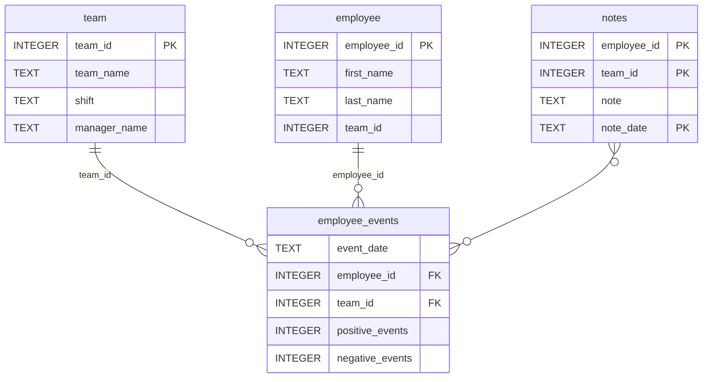

# Software Engineering for Data Scientists 

This repository contains starter code for the **Software Engineering for Data Scientists** final project. Please reference your course materials for documentation on this repository's structure and important files. Happy coding!

## Installation Instructions

1. First install the required modules with the `requirements.txt` file

   ```bash
   pip install -r requirements.txt
   ```

2. Next install the `employee_events` package

   ```bash
   cd employee_events
   pip install -e .
   ```

   The `-e` prompt allows the module to be editable so that any changes you make to the code will immediately be reflected and you do not need to install the package again.
3. Depending on your setup, you may need to add the `python-package/employee_events` directory to your `PYTHONPATH`. For example, in Linux:

    ```bash
    export PYTHONPATH=$PWD/dsnd-dashboard-project/python-package:$PYTHONPATH
    ```
4. Run the dashboard

   ```bash
   python report/dashboard.py
   ```
5. NB: The instructions that mention setting the entity ID to `None` and `QueryBase` as the base model does not work as it does not have the necessary instance
   parameters to instantiate the report. Instead, we will bring up Employee #1 as the default. As such, are now presented with an interface that allows you to
   cycle between different employees and teams. Underneath, an SQL query is performed that will provide the necessary numerical quantifiers for assessment.
   You can choose either `Employee` or `Team` with the radio button, then use the dropdown menu to choose between the different employees or teams.

### Repository Structure
```
├── README.md
├── assets
│   ├── model.pkl
│   └── report.css
├── env
├── python-package
│   ├── employee_events
│   │   ├── __init__.py
│   │   ├── employee.py
│   │   ├── employee_events.db
│   │   ├── query_base.py
│   │   ├── sql_execution.py
│   │   └── team.py
│   ├── requirements.txt
│   ├── setup.py
├── report
│   ├── base_components
│   │   ├── __init__.py
│   │   ├── base_component.py
│   │   ├── data_table.py
│   │   ├── dropdown.py
│   │   ├── matplotlib_viz.py
│   │   └── radio.py
│   ├── combined_components
│   │   ├── __init__.py
│   │   ├── combined_component.py
│   │   └── form_group.py
│   ├── dashboard.py
│   └── utils.py
├── requirements.txt
├── start
├── tests
    └── test_employee_events.py
```

### employee_events.db


